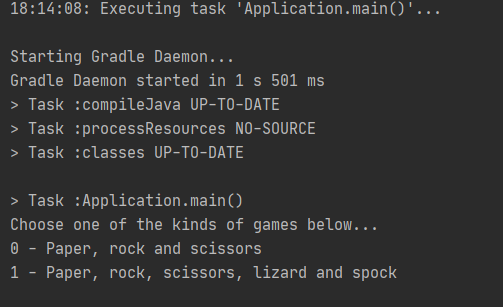
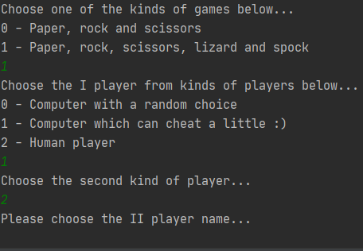
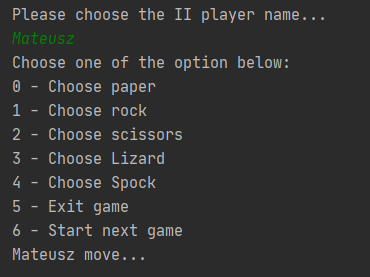
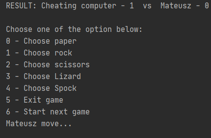

# Paper-Scissors-Rock-Lizard-Spock console-game

## Table of contents
* [Introduction](##Introduction)
* [Screenshots](##Screenshots)
* [Technology](##Technology)
* [How to start up an application](##HowToStartUpAnApplication)

## Introduction
### Paper-Scissors-Rock-Lizard-Spock is a simple console-game -> the name of the game speaks for itself :)

## Screenshots
* First step - After run you have to option of a game.

* A Second step - after first step you can choose first and second player (computer, cheating computer, human player)
and after that choose the names.

* Third step - make move.

* Fourth step - there is a result of move below previous step. make another move. 

## Technology
- Java 8
- Gradle

## How to start up an application
* First option - You should open the project in some IDE(Integrated development environment), 
for example IntelliJ IDEA or Eclipse. After this You should run a main method in Application class.
* Second option - You can open a game by a download only "game_run_files" folder and run the game
by double-click on game.bat file.
